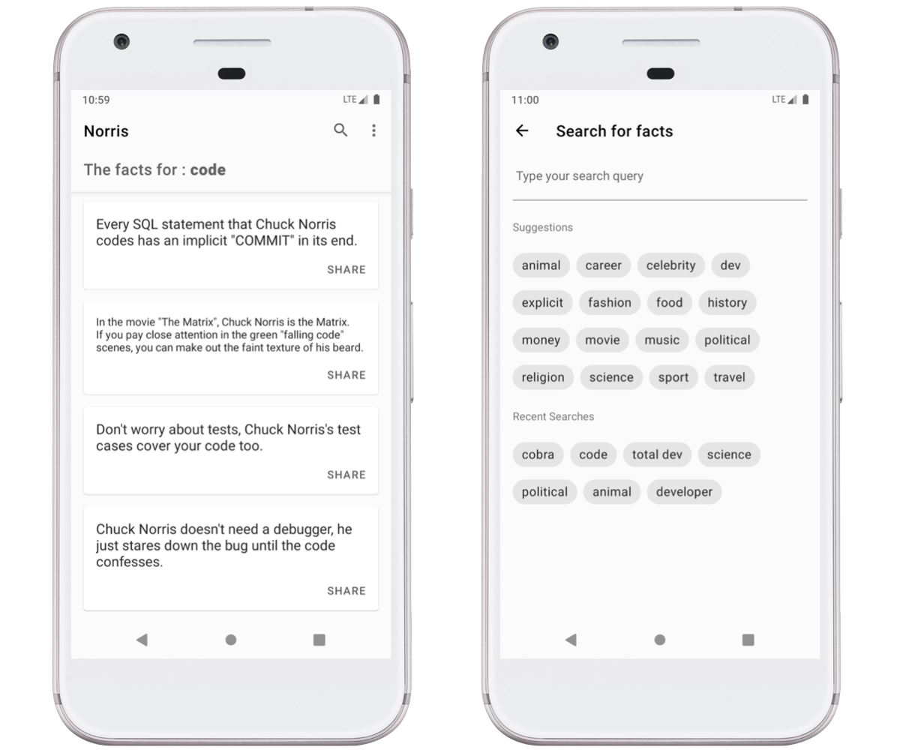

# Norris
[](https://circleci.com/gh/dotanuki-labs/norris/tree/master) [](https://ktlint.github.io/) [](https://codeclimate.com/github/dotanuki-labs/norris/maintainability) [](https://codecov.io/gh/dotanuki-labs/norris) [](https://codebeat.co/projects/github-com-dotanuki-labs-norris-master) [](https://www.codacy.com/app/ubiratansoares/norris?utm_source=github.com&amp;utm_medium=referral&amp;utm_content=dotanuki-labs/norris&amp;utm_campaign=Badge_Grade)


> An app that existed even before Android existed!

## About

Norris is a showcase for modern and well-crafted Android code. 

Here you will find a codebase powered by tests in all semantic levels (unit, integratation, acceptance) as well an architectural design that promotes discipline over state, using Kotlin Coroutines as foundation for a pragmatic unidirectional dataflow implementation.


## Project Overview

This project leverages on [api.chucknorris.io](https://api.chucknorris.io/) as remote data source to implement the following use cases

- User can search for Chuck Norris facts and share them
- Related categories are fetched in the application boostraped and cached
- Application will offer suggestions for queries based on categories names and track query terms provided by user as well




The code is structured in a multi-module fashion, with semantics guided by Clean Architecure; this means that high level modules (like `facts` or `search`) don't know anything about low-level ones (like `networking` or `persistance`). 

The `domain` module defines the core protocols to be implemented by low level details, while aggregates them in high level policies like [FetchFacts](https://github.com/dotanuki-labs/norris/blob/master/domain/src/main/java/io/dotanuki/norris/domain/FetchFacts.kt)

A general representation of the module structure is such as follow. Beyond `domain`, there are modules shared between all features like `navigator`, `shared-assets` and others.


This project uses a custom implementation of unidirectional data flow in order to organise the responsabilities of abstractions on top of UI layer. Beyond the semantics of the defined protocols, we leverage a custom `StateMachine` that will process states and send them over a `ConflatedBroadcastChannel` to consumers.

The design of abstractions enforce that Coroutine's Scopes related to the emission and consumption of states are decoupled; in this way, we also have a notion of `StateContainer`, that will provide both the `emissionScope` and the `Flow<T>` implementation for emissions. 

You may want to check the [ConfigChangesAwareStateContainer](https://github.com/dotanuki-labs/norris/blob/master/shared-utilities/src/main/java/io/dotanuki/norris/features/utilties/ConfigChangesAwareStateContainer.kt) abstraction, which leverages on Jetpack's ViewModel to keep the reference of the aforementioned ConflatedChannel, as well to provide the proper emission scope for states. An unbounded implementation is also defined for test purposes.

In this way, none of the ViewModels of this project derives from `AAC ViewModel`, but `AAC ViewModel` ensures the `UI` state persistance across device configuration changes.

Last, but not least, the choice for the `Flow<T>` over the conflated channel allows us to follow the reactive way for UIs without any LiveDatas. Just beautiful and simple.


This project has some remaining tasks. Follow the [project board](https://github.com/dotanuki-labs/norris/projects/1) to learn about what is going on

## Related blog posts

I'm writing a series of blog posts related to this project. They will explain some project decisions, as well dive into some details of implementation of this approach for unidirectional data flow, specially with learnings related to Coroutines and Channels.

Coming soon at [ubiratansoares.dev](https://ubiratansoares.dev)

## Building and Running

If you want a simple run, just use the companion script

```
./emulate-ci-build.sh
```

It will

- Run static analysers ([Ktlint](https://github.com/pinterest/ktlint) and [Detekt](https://arturbosch.github.io/detekt/))
- Run all unit tests and generate all JaCoCo reports
- Assemble the debug APK

For running acceptance tests

```
./gradlew connectedCheck
```

## Credits

- [Mathias Schilling](https://github.com/matchilling), for the Chuck Norris facts [REST api](https://api.chucknorris.io/)
- [Material Design Icons](https://materialdesignicons.com/) for the error states images
- [Jetbrains](https://www.jetbrains.com/) for the amazing developer experience around Kotlin and Coroutines
- Someone in the Web for the Norris clipart ❤️ _(I'll be happy to put your name here, ping me!)_

## Author

Coded by Ubiratan Soares (follow me on [Twitter](https://twitter.com/ubiratanfsoares))


## License

```
The MIT License (MIT)

Copyright (c) 2019 Dotanuki Labs

Permission is hereby granted, free of charge, to any person obtaining a copy of
this software and associated documentation files (the "Software"), to deal in
the Software without restriction, including without limitation the rights to
use, copy, modify, merge, publish, distribute, sublicense, and/or sell copies of
the Software, and to permit persons to whom the Software is furnished to do so,
subject to the following conditions:

The above copyright notice and this permission notice shall be included in all
copies or substantial portions of the Software.

THE SOFTWARE IS PROVIDED "AS IS", WITHOUT WARRANTY OF ANY KIND, EXPRESS OR
IMPLIED, INCLUDING BUT NOT LIMITED TO THE WARRANTIES OF MERCHANTABILITY, FITNESS
FOR A PARTICULAR PURPOSE AND NONINFRINGEMENT. IN NO EVENT SHALL THE AUTHORS OR
COPYRIGHT HOLDERS BE LIABLE FOR ANY CLAIM, DAMAGES OR OTHER LIABILITY, WHETHER
IN AN ACTION OF CONTRACT, TORT OR OTHERWISE, ARISING FROM, OUT OF OR IN
CONNECTION WITH THE SOFTWARE OR THE USE OR OTHER DEALINGS IN THE SOFTWARE.
```